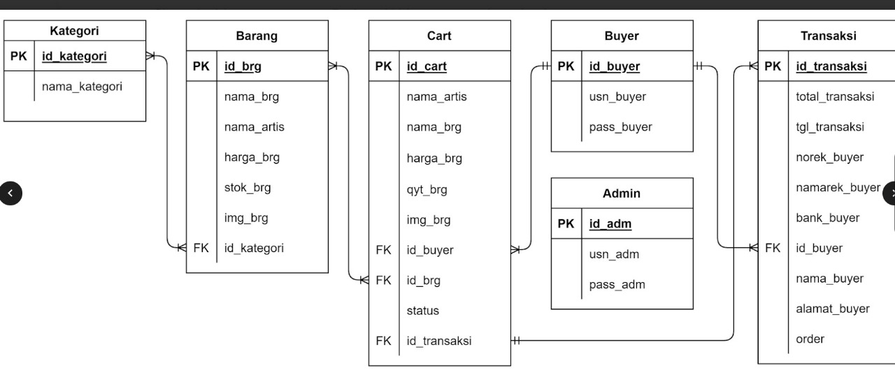

# proyek-web-pemwebisme
proyek-web-pemwebisme created by GitHub Classroom
README

## Anggota Kelompok : 
| NPM           | Name                     |
| ------------- |--------------------------|
| 140810210004  | Jonathan Nugroho Adhi W. |
| 140810210019  | Louis Koni Sung          |
| 140810210039  | Daffa Burane Nugraha     |

## Fungsi : 
Sebagai wadah untuk menjual barang-barang dari berbagai game online di website

## Tujuan : 
Membantu para gamers untuk membeli barang barang game favoritnya dengan mudah dan aman

## Target Pengguna:
Anak muda, gamers/penggemar game

## Mockup Kasar Sederhana:
https://www.figma.com/file/hbTyvFpHdBq2dYd1GjWdHn/Mockup-Kasar?type=design&node-id=0%3A1&mode=design&t=RLllNflYLBabcZor-1 

## Skema Database:

